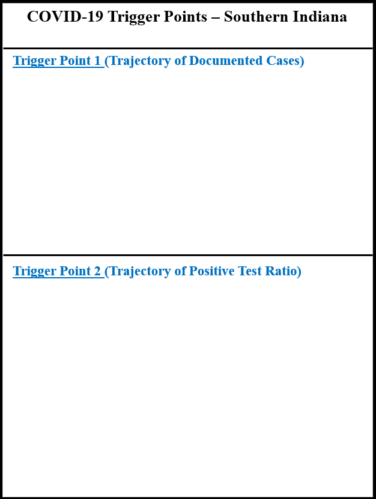
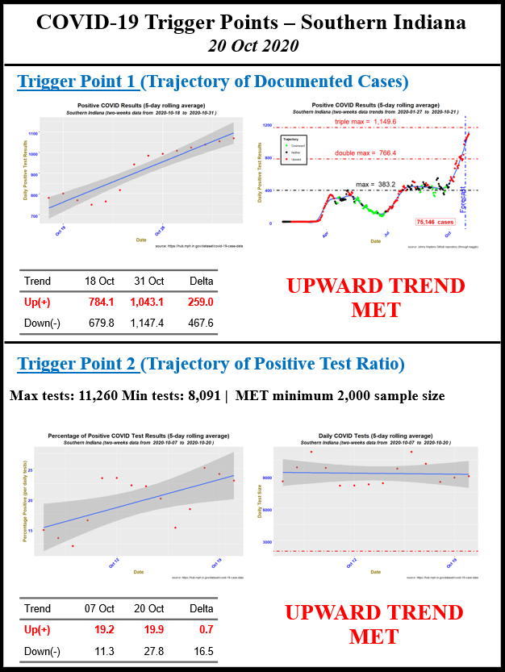

```{r setup, include=FALSE}

#####Make sure you load any required packages.

knitr::opts_chunk$set(echo = TRUE)

```


During the first week of March 2020, Indiana received its first confirmed COVID-19 case. Less than three weeks later, its Governor issued a ‘stay at home’ order. In response to this pandemic, Crane Army Ammunition Activity (CAAA), an organic industrial base located in Southern Indiana, activated its Crisis Management Team (CMT) and began implementing workforce protective measures such as social distancing and equipment/facility disinfecting, along with sending increased risk employees home on weather & safety leave or telework. With its mission to support warfighters, CAAA produces, receives, stores, and ships munitions. With a reduced workforce, non-essential mission activities began to suffer. By mid-April, the White House unveiled a three-phase approach to restoring normal commerce and services; [Opening Up America Again](https://trumpwhitehouse.archives.gov/openingamerica/) guidelines, which focused on places that have strong testing and are seeing a decrease in COVID-19 cases. This required trajectory assessments of documented cases and positive test percentage, along with capacity assessments for testing and medical treatment facilities. These assessments required valid data with current information each day. As part of my data retrieval efforts, I considered several online data sources, such as the New York Times, Johns Hopkins University, and the COVID Tracking Project. Though there were some conspicuous discrepancies between them, there contained strong correlations of the data found in these sources. Initially, I developed simple models using Microsoft Excel. After several weeks, more complex models were required, especially with large amounts of data available and the need for reliable data wrangling efforts. Using R programming, I developed scripts to assess trends that supported decisions made by the CMT. These scripts included rolling averages and simple exponential smoothing forecasting.


<center><b>Import Your Data</center></b>
In the following script, I installed required R libraries and imported the COVID-related data. 

```{r data_import, message=FALSE, warning=FALSE}
if (!require("pacman")) install.packages("pacman")
pacman::p_load(pacman, choroplethr, choroplethrMaps, data.table, dplyr, 
               flextable, forcats, forecast, geosphere, ggmap, ggrepel, 
               ggthemes, httr, mapdata, maps, maptools, matrixStats, officer, 
               png, readxl, sp, stringr, tidyr, tidyverse)
#
# input COVID US data by county and rename the attributes
#
df <- read.csv("covid_us_county.csv")
df <- rename(df, "FIPS" = "fips")
df <- rename(df, "State" = "state")
df <- rename(df, "Date" = "date")
df$Date <- as.Date(df$Date, "%Y-%m-%d")               # convert to date format
df <- rename(df, "Cases" = "cases")
#
# input COVID Indiana data by county and population info
#
county_in <- read.csv("county_indiana.csv")           # data for Indiana
unit_map <- county_in[county_in$unit == 1,]
unit_map <- unit_map[-c(3:5)]
unit <- county_in[county_in$unit == 1,]
unit$percent <- 100 * unit$pop_unit/sum(unit$pop_unit)
midwest = c("Illinois", "Indiana", "Iowa", "Kansas", "Michigan",
            "Minnesota", "Missouri", "Nebraska", "North Dakota",
            "Ohio", "South Dakota", "Wisconsin")
south_ind <- county_in$FIPS[county_in$south == 1]
south_ind1 <- county_in$county[county_in$south == 1]
#
# input info on states and the population of counties from 2019
#
states <- read.csv("states.csv")
pop <- read.csv("population_2019.csv")                # obtain county population
```

## COVID Trigger Points
On 17 April 17 2020, in response to closures of companies, schools, and other critical organizations, the White House unveiled guidelines for [Opening Up America Again](https://trumpwhitehouse.archives.gov/openingamerica/). This was a three-phased approach based on the advice of public health experts. These steps were intended to help state and local officials when reopening their economies, getting people back to work, and continuing to protect American lives. Using this guidelines, I developed two trigger points for: 1) a "<i>downward trajectory of documented cases within a 14-day period</i> and 2) a "<i>downward trajectory of positive tests as a percent of total tests within a 14-day period</i>."

<center><b>Constraints</center></b>
1. <u>Trigger Points</u>. The analyses were limited to the two proposed triggers (positive cases and test ratio trends) identified in the [Opening Up America Again](https://trumpwhitehouse.archives.gov/openingamerica/) guidelines.<br>
2. <u>COVID Testing</u>. The available tests were limited, impacting sampling representation of the population pool. Recommend target of at least 1% of population with min of 0.1%.

<center><b>Limitations</center></b>
1. <u>Negative Tests</u>.  For Indiana, this was the Total minus Positive. As such, Negatives were a lower bound, and may not have included all private labs.<br>
2. <u>Data Update Frequency</u>. Some data were updated throughout the day, while others, such as Indiana data were updated daily. So, analyses is limited to daily.<br>
3. <u>Firewall</u>. Unable to access COVID-19 county data because of firewall.  Submitted helpdesk ticket to request permission. Backup on personal work computer.

<center><b>Assumptions</center></b>
1. <u>Data Accuracy</u>.  Hundreds of volunteer data-gatherers, developers, scientists and  reporters contributed to databases. Though data entry errors were likely, they were not considered.<br>
2. <u>County Data</u>. Some data represented location of treatment, while others represented location of residence. For our analyses, I assumed the location of the persons from the location of the test.

## TRIGGER POINT 1 (trajectory of documented cases)

To calculate this first trigger points, I used the 95% confidence interval plot depicted by the gray area in the linear regression graph seen below. From this graph, I obtained the upper value (<b>point 1</b>) and lower value (<b>point 3</b>) of the gray area for the first day and the upper value (<b>point 4</b>) and lower value (<b>point 2</b>) of the gray area for the fourteenth day. The slope for an upward trend was the difference between points 2 and 1, while the slope for a downward trend was the difference between points 4 and 3. If the upward slope was positive, then we had an upward trend with a 95% confidence level.  Likewise, if the downward slope was negative, then we had a downward trend with the same confidence level.  However, as neither of these were met in this example, we did not have either an upward or downward trend in COVID cases. TRIGGER NOT MET.

```{r image1,fig.align="center", echo=FALSE}
####Add Image of data


```

<center><b>Slope function</b></center>
The following script contained the function to calculate the slope of the data for the previous 14 days for each data entry using a simple linear regression model.  It also returned a data frame with the following values for each date: <i>point 1, point 2, upward trigger slope, point 3, point 4, and downward trigger slope</i>.

```{r slope_fn, message=FALSE, warning=FALSE}
slope <- function(x,y){
  lm.model <- lm(y ~ x)
  b0 <- lm.model$coefficients[1]
  b1 <- lm.model$coefficients[2]
  n <- length(y) 
  sse <- sum((y - lm.model$fitted.values)^2)
  mse <- sse / (n - 2)
  t.val <- qt((1+conf_int)/2, n - 2) 
  x_new <- 1:max(x)
  y.fit <- b1 * x_new + b0
  se <- sqrt(sum((y - y.fit)^2) / (n - 2)) * 
    sqrt(1 / n + (x - mean(x))^2 / sum((x - mean(x))^2))
  x_new2 <- 1:max(x + 100)
  y.fit2 <- b1 * x_new2 + b0
  slope.upper <- round(suppressWarnings(y.fit2 + t.val * se), 1)
  slope.lower <- round(suppressWarnings(y.fit2 - t.val * se), 1)
  out<-data.frame(slope.upper[1], slope.lower[n], slope.lower[n]-slope.upper[1],
                  slope.lower[1], slope.upper[n], slope.upper[n]-slope.lower[1])
  names<-c("u1", "un", "ud", "d1", "dn", "dd")
  colnames(out) <- names
  out
}
conf_int <- 0.95                          # set confidence interval
options(scipen = 999)                     # turn off scientific notation (1e-09)
```

The following graphs illustrated these trigger points with actual data for southern Indiana as of 2 May 2020.

```{r image2,fig.align="center", echo=FALSE}
####Add Image of data


```

* Top graph illustrated historical trends since 6 March 2020, with positive cases identified in <font color="red">Red</font> points. <font color="blue">Blue</font> line was calculated using Local Polynomial Regression (LOESS) curve-fitting techniques.  The shaded area represented a 95% confidence interval of the curve.
* Bottom graph illustrated past 14 days of data.  <font color="blue">Blue</font> line was calculated using linear regression, with the shaded area presenting the 95% confidence interval.
* <font color="green">Green</font> line indicated that a negative trend can be seen within this confidence interval.
* <font color="red">Red</font> line indicated that a positive trend can be seen within this confidence interval. So, the trigger was NOT met within 95% confidence level as of 2 May 2020. Note that had the <font color="green">Green</font> line been positive, this would have resulted in an upward trend being met within the 95% confidence level.

<center><b>Data function</center></b>
The following function removed NA dates, summarized the cases by date, calculated a 5-day rolling average, and computed the differences between dates. In addition, this calculated a simple exponential smoothing forecasting that predicted the expected cases five days into the future. This forecasting method uses Holt's linear trend method. This method involves a forecast equation, an alpha (&alpha;) smoothing level equation, and a beta (&beta;) smoothing trend level. For this simple forecast, the trend is linear.

```{r data_fn, message=FALSE, warning=FALSE}
data_fn <- function(df) {
  #  group by date
  daily1 <- df%>% group_by(Date) %>% 
    summarize(number=sum(Cases))
  daily1$number <- c(0, diff(daily1$number))            # compute difference
  daily1 <- daily1[!is.na(daily1$Date),]                # remove NA dates
  daily1$roll_avg <- frollmean(daily1$number, 5)        # calc 5-day roll'g avg
  last14 <- daily1 %>% top_n(14,Date)                   # Extract last two weeks
  predict1 <- holt(last14$roll_avg, h=5, intial="simple")
  lastD <- last14$Date[14] + 1
  dates1 <- c(lastD,lastD+1,lastD+2,lastD+3,lastD+4)
  forecast1 <- tibble(dates1, predict1$mean)
  colnames(forecast1) <- c("Date", "roll_avg")
  forecast1$roll_avg <- as.numeric(forecast1$roll_avg)
  n<- length(daily1$Date)-5                             # length of the data
  lastn <- daily1 %>% top_n(n,Date)  
  lastn <- lastn[-2]
  lastn <- rbind(lastn, forecast1)
}
```

<center><b>Up and Down trend function</center></b>
The following function calculated the upward and downward trigger slopes for each date.

```{r trend_fn, message=FALSE, warning=FALSE}
trend <- function(lastn){
  out = NULL                                       # Create empty value
  n <- length(lastn$Date)
  nt<- n-13                                        # number of 2-week data points
  # Calculate trigger point analyses for each day in set
  for(i in 1:nt) {
    n1<-i+13
    w<-lastn[i:n1,1:2]
    y<-w$roll_avg
    x <- c(1:14)
    info<-slope(x,y)
    out = rbind(out, c(info$ud, info$dd))
  }
  out<-as.data.table(out)                          # Convert to table
  out<- cbind(out,lastn$roll_avg[14:n],lastn$Date[14:n])
}
```

<center><b>Total cases function</center></b>
The following function summarized the cases by date, removed NA dates, and computed the differences from one date to another.

```{r total_fn, message=FALSE, warning=FALSE}
total_fn <- function(df){
  #  group by date
  daily1 <- df %>% group_by(Date) %>% 
    summarize(number=sum(Cases))
  daily1$number <- c(0, diff(daily1$number))                # compute difference
  daily1 <- daily1[!is.na(daily1$Date),]                    # remove NA dates
  total <- sum(daily1$number)                               # calc total cases
}
```

<center><b>Plot function</center></b>
This function calculated a graph of the data using the following elements:

* Modification of graph title using text input.
* Calculation of a smoothing curve using the Local Polynomial Regression (LOESS) curve-fitting techniques with a user-supplied confidence level.
* Color-coding of the data points with <font color="red">RED</font> for upward trend, <font color="green">GREEN</font> for downward trend, and BLACK for neither.
* Identifying the source of the data from Johns Hopkins Github repository with the date of the data capture in the caption.
* Inclusion of a dashed vertical line for the "as of" date, with data after that indicating the 5-day forecast.
* Inclusion of three dashed horizontal lines to indicate the maximum daily cases as of 1 June 2020 and the amounts that were double  and triple that amount.  The numerical values for those were annotated above each line.

```{r plot_fn, message=FALSE, warning=FALSE}
COVID_plot <- function(data, x, y, max1, text, conf_int, out) {
  max_y <- round(0.25* max(lastn$roll_avg, 0))
    colnames(out) <- c("upward", "downward", "roll_avg", "date")
  # Create a column indicating upward(U), downwar(D), no(N) trend
  out$trigger<- ifelse(out$upward>=0, "U", 
                      ifelse(out$downward<=0, "D", "N"))
  up <- out[out$trigger %in% "U", ]      # separate table of upward trend dates
  down <- out[out$trigger %in% "D", ]    # separate table of downward trend dates
  max1 <- max(data$roll_avg[data$Date < "2020-06-01"]) # max as-of date
  lastD <- max(data$Date) - 5            # must subtract forecast dates (5)
  textm <- paste("max = ", format(max1, big.mark = ","))
  text2m <- paste("double max = ", format(2*max1, big.mark = ","))
  text3m <- paste("triple max = ", format(3*max1, big.mark = ","))
  # Create plot sub-title using min and max dates in data
  text <- paste(text, min(lastn$Date), " to ", lastD-5, ")")
  text1 <- paste(format(total, big.mark = ","), " cases")
  ggplot(data, aes({{x}}, {{y}})) +
    geom_smooth(method="loess", level=conf_int, span=0.2) +
    geom_point(size=2, aes(color="Neither")) + 
    geom_point(data=down, aes(x=date, y=roll_avg, color = "Downward"), size=2) +
    geom_point(data=up, aes(x=date, y=roll_avg, color = "Upward"), size=2) +
    scale_color_manual("Trajectory",
                       breaks = c("Downward", "Neither", "Upward"),
                       values = c("Downward"="green", "Neither"="black", 
                                "Upward"="red")) +
    theme(axis.text.x = element_text(angle = 45, hjust = 1, face="bold",
                                     color="blue", size=10),
          axis.title.x=element_text(size=12, face="bold", color="gold4"),
          axis.text.y = element_text(vjust = 1, face="bold", color="blue", 
                                     size=10),
          axis.title.y=element_text(size=12, face="bold", color="gold4"),
          legend.title=element_text(size=8, face="bold"),
          legend.position = c(.1, .7),
          panel.background = element_blank(), 
          legend.box.background = element_rect(color = "black", size=2),
          plot.title=element_text(size=15, face="bold", hjust=0.5),
          plot.subtitle=element_text(size=12, face="bold.italic", hjust=0.5)) +
    labs(title="Positive COVID Results (5-day rolling average)", 
         caption = "source: Johns Hopkins Github repository (through kaggle)",
         subtitle=text, x="Date", y="Daily Positive Test Results") +
    geom_vline(xintercept=lastD, linetype=4, color ="blue", size = 1) +
    geom_hline(yintercept=max1, linetype=4, color="black", size=1) +
    geom_hline(yintercept=2*max1, linetype=4, color="red", size=1) +
    geom_hline(yintercept=3*max1, linetype=4, color="red", size=1) +
    annotate(geom="text", x=mean(lastn$Date), y = 1.2*max1, label = textm,
             color = "black", size = 6, angle=0) +
    annotate(geom="text", x=mean(lastn$Date)-15, y = 2.2*max1, label = text2m,
             color = "red", size = 6, angle=0) +
    annotate(geom="text", x=mean(lastn$Date)-15, y = 3.2*max1, label = text3m,
             color = "red", size = 6, angle=0) +
    annotate(geom="text", x=lastD-5, y=max_y, label = "Forecast",  color ="blue", 
             size = 6, angle=90) +
    annotate("label", x = max(lastn$Date)-50, y = 0, label = text1, 
             color = "red", fontface = 2, size = 5)
}
```


## Southern Indiana COVID plot
The following code extracted Southern Indiana counties from the COVID data frame. To create and print the COVID graph, this code called the data, total, trend, and plot functions in sequential order.

```{r south_IN, message=FALSE, warning=FALSE}
df1 <- df[-c(2:5, 8, 9)]
south_ind <- county_in$FIPS[county_in$south == 1]
south_ind1 <- county_in$county[county_in$south == 1]
df1 <- df1[df1$FIPS %in% south_ind, ]                     # extract regional data
lastn <- data_fn(df1)                                     # data function
total <- total_fn(df1)                                    # total cases
out <- trend(lastn)                                       # up/down trend
text <- "Southern Indiana (two-weeks data trends from "
p1p <- COVID_plot(lastn, Date, roll_avg, max1, text, conf_int, out)
p1p
```

This graph indicated that there was a plateau of new cases during the months of August and September at the max daily rate of around 380, had steadily climbed upward since the first of October to twice that amount, and was expected to triple it by the end of the month. 

## Indiana COVID plot
The following code extracted Indiana from the COVID data frame. To create and print the COVID graph, this code called the data, total, trend, and plot functions in sequential order.

```{r Indiana, message=FALSE, warning=FALSE}
df2 <- df[-c(1, 2, 4, 5, 8, 9)]                             # extract state data
df2 <- df2[df2$State %in% "Indiana", ]                      # extract Indiana data
lastn <- data_fn(df2)                                       # data function
total <- total_fn(df2)                                      # total cases
out <- trend(lastn)                                         # up/down trend
text <- "Indiana (two-weeks data trends from "
COVID_plot(lastn, Date, roll_avg, max1, text, conf_int, out)
```

This graph indicated that there was a plateau of new cases during the months of August and September slightly above the max daily rate of 723, had steadily climbed upward since the first of October to tripled that amount, and was expected to exceed 2,500 cases by the end of the month.

## mid-West US graph
The following code extracted mid-West states (<i>Illinois, Indiana, Iowa, Kansas, Michigan, Minnesota, Missouri, Nebraska, North Dakota, Ohio, South Dakota, and Wisconsin</i>) from the COVID data frame. To create and print the COVID graph, this code called the data, total, trend, and plot functions in sequential order.

```{r midwest, message=FALSE, warning=FALSE}
df3 <- df[-c(1, 2, 4, 5, 8, 9)]                             # extract state data
midwest = c("Illinois", "Indiana", "Iowa", "Kansas", "Michigan",
            "Minnesota", "Missouri", "Nebraska", "North Dakota",
            "Ohio", "South Dakota", "Wisconsin")
df3 <- df3[df3$State %in% midwest, ]                        # extract Midwest data
lastn <- data_fn(df3)                                       # data function
total <- total_fn(df3)                                      # total cases
out <- trend(lastn)                                         # up/down trend
text <- "Mid-West US (two-weeks data trends from "
COVID_plot(lastn, Date, roll_avg, max1, text, conf_int, out)
```

This graph indicated that there was a slight increase of new cases during the months of August and September near a daily rate of 7,500, had steadily climbed upward since the first of October to tripled that amount, and was expected to exceed 25,000 cases by the end of the month.

## US graph
The following code used the entire data frame of COVID cases and did not need to extract data from it. To create and print the COVID graph, this code called the data, total, trend, and plot functions in sequential order.

```{r US, message=FALSE, warning=FALSE}
df4 <- df[-c(1, 2, 4, 5, 8, 9)]                             # extract state data
lastn <- data_fn(df4)                                       # data function
total <- total_fn(df4)                                      # total cases
out <- trend(lastn)                                         # up/down trend
text <- "United States (two-weeks data trends from "
COVID_plot(lastn, Date, roll_avg, max1, text, conf_int, out)
```

Unlike the graphs for the mid-West states, this graph indicated that the US as a whole doubled the max rate by the middle of July with 65,000 cases, and had spent the next two month steadily reducing this amount until the daily cases dropped by nearly a half. However, beginning the end of September, the cases steadily rose and returned to the 65,000 cases and was expected to increase even further.

## Population percentage by state choropleth map
The following code extracted the last entry (by date) of the COVID data frame. It wrangled the data and merged in the population of each state. Then, it calculated the percentage of the population with COVID, assuming that none of these cases were for individuals testing positive more than one time. After that, I created a group of five ordered factors of those percentages, grouped into 0.75% sized buckets. Finally, I developed a choropleth map of the states based upon their percentage factor groups. Because the state and county choropleths had different codes, I did not develop a choropleth function for this.

```{r US_state, message=FALSE, warning=FALSE}
df5 <- df[c(3, 6, 7)]                                       # extract state data
df5 <- df5[df5$Date %in% max(df5$Date),]
df5 <- df5[-2]
#
# extracts state population
#
pop_state <- pop[-3] 
pop_state$population <- as.numeric(gsub(",","",pop_state$population))
states <- rename(states, "State" = "state")
pop_state <- merge(pop_state, states, by="State")
pop_state <- pop_state[-c(1,4,5)]
pop_state <- rename(pop_state, "State" = "name")
pop_state <- pop_state[-1]
pop_state <- pop_state %>% 
  group_by(State) %>% 
  summarize_all(sum)
pop_state$population <- pop_state$population/2
#
# merge state population into the COVID data frame
#
df5 <- df5 %>% 
  group_by(State) %>% 
  summarize_all(sum)
df5 <- merge(df5, pop_state, by="State")
df5 <- rename(df5, "pop" = "population")                         # rename column
df5 <- rename(df5, "number" = "Cases")                           # rename column
df5 <- rename(df5, "region" = "State")                           # rename column
df5$region <- tolower(df5$region)
#
# calculate percentage of state population with COVID
#
current <- df5
current$value <- 100*current$number/current$pop
current <- current[!is.na(current$value),]
current$group1 <- ifelse(current$value < 0.75, "0.0-0.75%",
                  ifelse(current$value < 1.5, "0.75-1.5%",
                  ifelse(current$value < 2.25, "1.5-2.25%",
                  ifelse(current$value < 3.0, "2.25-3.0%", "3.0+%"))))
#
# Create plot sub-title using min and max dates in data
#
text <- paste("US State Percentage COVID Positive (as of", 
              max(df$Date)-5, ")")
statesMap<-map_data("state")
statesMap$state <- state.abb[match(statesMap$region, tolower(state.name))]
#
# create the choropleth of the data
#
choropleth <- merge(statesMap, current, by = "region")
choropleth <- choropleth[order(choropleth$value), ]
ggplot()+
  geom_polygon(data=choropleth, aes(long,lat, group=group, fill=group1),
               color="black",size=.2) + 
  coord_map()  +
  geom_text(data = states, aes(long, lat, label = State, group = NULL), 
            size = 4) +
  scale_fill_brewer(name = "Percentage",palette="RdYlGn", direction = -1,
                    na.value = "white") +
  labs(x="", y="",fill="", title= text) + 
  theme(axis.ticks.y = element_blank(),axis.text.y = element_blank(),
        axis.ticks.x = element_blank(),axis.text.x = element_blank(),
        panel.background = element_blank(),
        legend.position = c(0.9, 0.3),
        legend.title = element_text(size=12, colour = "darkblue", face="bold"),
        legend.text = element_text(colour="darkblue", size=10, face="bold"),
        plot.title = element_text(size = 18, face = "bold"))
```

Based upon this choropleth graph of US States, the southern states and most of the mid-west had the highest percentage of their population infected with COVID.  The Pacific Northwest, New England, and a rural state in the Appalachian Mountains (West Virginia) had the lowest level.  However, this was at the overall state level, not depicting rural versus urban centers.

## US population percentage by county choropleth map
The following code extracted the last entry (by date) of the COVID data frame. It wrangled the data and merged in the population of each county. Then, it calculated the percentage of the population with COVID, assuming that none of these cases were for individuals testing positive more than one time. After that, I created a group of five ordered factors of those percentages, grouped into 0.75% sized buckets. 

<center><b>County choropleth function</b></center>
The following script contained the function to graph a choropleth map of the COVID data. 

```{r choropleth_fn, message=FALSE, warning=FALSE}
choropleth_county <- function(df, text){
  county_choropleth(df, title = text, legend = "Percentage", num_colors = 5) +
    scale_fill_brewer(name = "Percentage",palette="RdYlGn", direction = -1,
                      na.value = "white")+ 
    theme(axis.ticks.y = element_blank(),axis.text.y = element_blank(),
          axis.ticks.x = element_blank(),axis.text.x = element_blank(),
          panel.background = element_blank(),
          legend.position = c(0.9, 0.2),
          legend.title = element_text(size=12, colour = "darkblue", face="bold"),
          legend.text = element_text(colour="darkblue", size=10, face="bold"),
          plot.title = element_text(size = 18, face = "bold", hjust=0.5))
}
```

Using the above function, the following was the script for creating a choropleth of all counties within the US. Note that there was no data for Alaska and Hawaii.

```{r US_county, message=FALSE, warning=FALSE}
df6 <- df[c(1, 6, 7)]                                       # extract state data
df6 <- rename(df6, "region" = "FIPS")                       # rename column
df6 <- df6[df6$Date %in% max(df6$Date),]
df6 <- df6[-2]
df6 <- merge(df6, pop, by="region")
df6 <- rename(df6, "pop" = "population")                    # rename column
#
# calculate percentage of county population with COVID
#
df6$pop <- as.numeric(gsub(",","",df6$pop))
df6$percent <- 100*df6$Cases/df6$pop
df6 <- subset(df6, select = -c(2,3))
df6 <- df6[!is.na(df6$percent),]
df6$value <- ifelse(df6$percent < 0.75, "0.0-0.75%",
             ifelse(df6$percent < 1.5, "0.75-1.5%",
             ifelse(df6$percent < 2.25, "1.5-2.25%",
             ifelse(df6$percent < 3.0, "2.25-3.0%", "3.0+%"))))
factors <- c("0.0-0.75%", "0.75-1.5%", "1.5-2.25%", "2.25-3.0%", "3.0+%")
df6$value <- as.factor(df6$value)
df6$value <- factor(df6$value, levels = factors)
text <- paste("US County % Population COVID Positive (", max(df$Date)-5, ")")
choropleth_county(df6, text)
```

This choropleth graph, depicting the infection percentage by county, demonstrated that nearly every county in the South and most of the rural areas in the mid-West had the highest rates of infection.  Likewise, the rural areas in other states had the lowest rates.

## Southern Indiana population percentage by county choropleth map
This choropleth used an entirely different set of code to graph. This used a county map to select the counties for the graph.  I also included the locations and names of the 8 largest cities in this region.

```{r s_in_county, message=FALSE, warning=FALSE}
latlongs <- read.csv("latlongs.csv")                          # 8 largest cities
countyMap <- map_data("county")
countyMap <- subset (countyMap, region == "indiana")
countyMap <- rename(countyMap, "county" = "subregion")        # rename column
unit_map1 <- countyMap
unit_map1 <- unit_map1[unit_map1$county %in% south_ind1, ]
unit_map1 <- unit_map1[order(unit_map1$order), ]
countyMap <- countyMap[countyMap$county %in% south_ind1, ]
countyMap <- rename(countyMap, "state" = "region")            # rename column
df7<-df6
df7$county <- tolower(df7$county)
df7$county <- str_remove(df7$county, " county")
df7 <- rename(df7, "change" = "percent")
#df7 <- df7[-c(3,4)]
df7 <- df7[df7$region %in% south_ind,]
choropleth <- merge(countyMap, df7, by = "county", all.x = TRUE, sort = FALSE)
choropleth <- choropleth[order(choropleth$order), ]
choropleth$value <- as.factor(choropleth$value)
unit_map2 <- choropleth %>% 
  filter(county %in% unit_map$county) 
text <- paste("Southern Indiana % COVID Positive (as of ", max(df$Date)-5, ")")
ggplot() +
  geom_polygon(data=choropleth, aes(long,lat, group=group, fill=value),
               color="black",size=.2) +
  geom_polygon(data=unit_map2, aes(long,lat, group=group), fill=NA,
               color="black",size=2) +
  coord_fixed(1.3) + 
  scale_fill_manual(name = "Percentage", values = c("darkolivegreen3","lemonchiffon1", 
                                                    "coral", "red")) +
  geom_label_repel(data = latlongs, aes(x = lon, y = lat, label = city), 
                   color = "black", box.padding = 0.5) + 
  geom_point(data = latlongs, aes(x = lon, y = lat), size = 5, color = "black", 
             alpha = 1) +
  labs(x="", y="",fill="", title= text)+ 
  theme(axis.ticks.y = element_blank(),axis.text.y = element_blank(),
        axis.ticks.x = element_blank(),axis.text.x = element_blank(),
        panel.background = element_blank(),
        legend.position = c(1.1, 0.3),
        legend.title = element_text(size=12, colour = "darkblue", face="bold"),
        legend.text = element_text(colour="darkblue", size=10, face="bold"),
        plot.title = element_text(size = 18, face = "bold", hjust = 0.5),
        plot.caption = element_text(size=12, face = "italic"))
```

This choropleth graph showed that the high populated counties, those containing Indianapolis, Evansville, Terre Haute, and Bloomington, were the ones with the highest infection rates.


## Communicate graphs in PowerPoint slides

The following two slides contained the format for how I presented this first trigger point in weekly PowerPoint slides for senior decision-makers.

<b>Slide 1: daily results</b>
<i>(includes a graph for global cases that was generated from a script not included in this R Markdown file)</i>

```{r image3,fig.align="center", echo=FALSE}
####Add Image of data

```

<b>Slide 2: choropleth graphs</b>

```{r image4,fig.align="center", echo=FALSE}
####Add Image of data

```

# TRIGGER POINT 2 (trajectory of positive tests)

## Seven-day test average for the State of Indiana
This script calculates a seven-day average for COVID test in the State of Indiana.  Furthermore, this was sub-divided into four groups: Indiana, Southern Indiana, counties where employees live, and the top five counties for those same employees. Three thresholds were embedded into the graph to facilitate decisions. The first was <b>WATCH</b>, 8% new positive test results, which prompted a decision to send non-essential employees home.  The next was <b>SNAP BACK</b>, 13% new positive test results, which prompted a decision to send increased-risk employees (ie age and health related) home.  The last was <b>WARNING</b>, 18% new positive test results, which prompted stoppage of all non-critical work onsite.

```{r test_s_county, message=FALSE, warning=FALSE}
test_COVID <- read_excel("test_COVID_IN.xlsx")
county <- read.csv("county_pop.csv")
test_COVID <- rename(test_COVID, "tests" = "COVID_TESTS")
test_COVID <- rename(test_COVID, "county" = "COUNTY_NAME")
unit1 <- county_in[-c(1,3)]
unit1$county <- toupper(unit1$county)
unit1$unit_perc <- ifelse(unit1$unit == "1", 
                          unit1$pop_unit/sum(unit1$pop_unit), 0)
unit1$unit_perc <- round(unit1$unit_perc, digits = 3)
test_COVID$county <- toupper(test_COVID$county)
test_COVID <- merge(test_COVID, unit1, all.y=TRUE)
test_COVID <- rename(test_COVID, "date" = "DATE")
test_COVID$date <- as.Date(test_COVID$date, "%Y-%m-%d")
test_COVID <- test_COVID[!is.na(test_COVID$date),]
test_COVID <- merge(test_COVID, county, all.y=TRUE)
test_COVID <- rename(test_COVID, "population" = "value")
test_COVID <- rename(test_COVID, "cases" = "COVID_COUNT")
test_COVID <- rename(test_COVID, "deaths" = "COVID_DEATHS")
test_COVID1 <- test_COVID                              # df for next plot
top_c <- unique(test_COVID %>% select(unit_perc))      # identify top 5 counties
top_c <- top_n(top_c, 5)
test_COVID$group <- ifelse(test_COVID$unit_perc %in% top_c[,1], "T",
                    ifelse(test_COVID$unit_perc > "0", "U",
                    ifelse(test_COVID$region %in% south_ind, "S", "I")))
test_COVID$group <- as.factor(test_COVID$group)
test_COVID <- test_COVID[-2]
test_COVID <- test_COVID %>% 
  group_by(date, deaths, group) %>% 
  summarize(tests=sum(tests), cases=sum(cases), population = sum(population))
test_COVID <- test_COVID[test_COVID$tests != 0,]
test_COVID <- test_COVID[!is.na(test_COVID$date),]
T_pop <- sum(test_COVID$population[test_COVID$group == "T" &
                                     test_COVID$date == max(test_COVID$date)])
U_pop <- sum(test_COVID$population[test_COVID$group == "U" &
                                     test_COVID$date == max(test_COVID$date)]) + 
  T_pop
S_pop <- sum(test_COVID$population[test_COVID$group == "S" &
                                     test_COVID$date == max(test_COVID$date)]) + 
  U_pop
I_pop <- sum(test_COVID$population[test_COVID$group == "I" &
                                     test_COVID$date == max(test_COVID$date)]) +
  S_pop 
test_COVID$group_pop <- ifelse(test_COVID$group == "T", T_pop,
                               ifelse(test_COVID$group == "U", U_pop,
                                      ifelse(test_COVID$group == "S", S_pop, 
                                             I_pop)))
test_new <- test_COVID %>%
  group_by(date, group, group_pop) %>%
  summarize(test=sum(tests), cases=sum(cases))
test_plot = NULL                                  # Create empty value
test_data = NULL                                  # Create empty value
n <- length(unique(test_COVID$date))
nt<- n-6                                          # number of 1-week data points
min_d <- min(test_new$date)
#
# Calculate trigger point analyses for each day in set (may take some time)
#
for(i in 10:nt) {
  n1<-i+6
  w <-test_new %>% 
    filter(date == min_d + i)
  w = rbind(test_data, w)
  w <- w %>% 
    group_by(date, group) %>%
    mutate(csum = cumsum(cases))
  w<-w %>% 
    filter(date == min_d + i)
  test_data = rbind(test_data, w)
  y <- test_new %>% 
    filter(date > min_d + i & date < min_d + n1 + 1)
  y <- rbind(w, y)
  y <- y%>%group_by(group) %>%
    summarize(test=sum(test), cases=sum(cases), group_pop=mean(group_pop))
  y$test[y$group == "U"] <- y$test[y$group == "U"] + y$test[y$group == "T"]
  y$test[y$group == "S"] <- y$test[y$group == "S"] + y$test[y$group == "U"]
  y$test[y$group == "I"] <- y$test[y$group == "I"] + y$test[y$group == "S"]
  y$cases[y$group == "U"] <- y$cases[y$group == "U"] + y$cases[y$group == "T"]
  y$cases[y$group == "S"] <- y$cases[y$group == "S"] + y$cases[y$group == "U"]
  y$cases[y$group == "I"] <- y$cases[y$group == "I"] + y$cases[y$group == "S"]
  y <- y %>% 
    group_by(group) %>% 
    summarize(test_p = 100 * mean(cases)/mean(test), 
              cases_p = 100000 * sum(cases)/group_pop)
  y$date <- min_d + n1
  test_plot <- rbind(test_plot, y)
}
last14 <- test_plot %>% 
  top_n(4*14,date)                                      # Extract last two weeks
lastD <- max(last14$date) + 1
dates1 <- c(lastD,lastD+1,lastD+2,lastD+3,lastD+4)
predictI <- holt(last14$test_p[ which(last14$group == "I")], h=5, 
                 intial="simple")
forecastI <- tibble(dates1, predictI$mean)
colnames(forecastI) <- c("date", "test_p")
forecastI$test_p <- as.numeric(forecastI$test_p)
forecastI$group <- "I"
forecastI$cases_p <- NA
predictS <- holt(last14$test_p[ which(last14$group == "S")], h=5, 
                 intial="simple")
forecastS <- tibble(dates1, predictS$mean)
colnames(forecastS) <- c("date", "test_p")
forecastS$test_p <- as.numeric(forecastS$test_p)
forecastS$group <- "S"
forecastS$cases_p <- NA
predictC <- holt(last14$test_p[ which(last14$group == "U")], h=5, 
                 intial="simple")
forecastC <- tibble(dates1, predictC$mean)
colnames(forecastC) <- c("date", "test_p")
forecastC$test_p <- as.numeric(forecastC$test_p)
forecastC$group <- "U"
forecastC$cases_p <- NA
predictT <- holt(last14$test_p[ which(last14$group == "T")], h=5, 
                 intial="simple")
forecastT <- tibble(dates1, predictT$mean)
colnames(forecastT) <- c("date", "test_p")
forecastT$test_p <- as.numeric(forecastT$test_p)
forecastT$group <- "T"
forecastT$cases_p <- NA
test_plot <- rbind(test_plot, forecastI, forecastS, forecastC, forecastT)
text_main <- "Seven-Day Average of New Percentage COVID-19 Cases"
text_sub <- paste0("Indiana, Southern Indiana, and unit residence counties ",
                   "(as of ",max(test_plot$date)-5,")")
text1 <- "WATCH: Non-Essential Sent Home"
text2 <- "SNAP BACK: Increased-Risk Sent Home"
text3 <- "WARNING: Stop Non-Critical Work"
test_plot <- rename(test_plot, "Locations" = "group")
test_plot$Locations <- factor(test_plot$Locations, levels = c("I", "S", "U", "T"))
levels(test_plot$Locations)[1] <- "Indiana"
levels(test_plot$Locations)[2] <- "S_Indiana"
levels(test_plot$Locations)[3] <- "All_unit"
levels(test_plot$Locations)[4] <- "Top5_unit"
ggplot(test_plot, aes(x=date, y=test_p, color=Locations)) + 
  geom_smooth(method="loess", se=FALSE, span=0.2) +
  geom_point(size=1) + 
  scale_color_manual(values= c("purple", "green", "blue", "red")) +
  theme(axis.text.x = element_text(angle = 45, hjust = 1, face="bold",
                                   color="blue", size=10),
        axis.title.x=element_text(size=12, face="bold", color="gold4"),
        axis.text.y = element_text(vjust = 1, face="bold", color="blue", 
                                   size=10),
        axis.title.y=element_text(size=12, face="bold", color="gold4"),
        legend.title=element_text(size=8, face="bold"),
        legend.position = c(.1, .7),
        legend.box.background = element_rect(color = "black", size=2),
        panel.background = element_blank(),
        plot.title=element_text(size=15, face="bold", hjust=0.5),
        plot.subtitle=element_text(size=12, face="bold.italic", hjust=0.5)) +
  labs(title=text_main, 
       caption = "source: Johns Hopkins Github repository (through kaggle)",
       subtitle=text_sub, x="Date", y="New Percentage of Positive Test Results") +
  geom_hline(yintercept=8, linetype=4, color="black", size=1) +
  annotate(geom="text", x=mean(test_plot$date), y = 9, label = text1,
           color = "black", size = 5, angle=0) +
  geom_hline(yintercept=13, linetype=4, color="black", size=1) +
    annotate(geom="text", x=mean(test_plot$date), y = 14, label = text2,
             color = "black", size = 5, angle=0) +
  geom_hline(yintercept=18, linetype=4, color="black", size=1) +
    annotate(geom="text", x=mean(test_plot$date), y = 19, label = text3,
             color = "black", size = 5, angle=0) +
  geom_vline(xintercept=lastD, linetype=4, color ="blue", size = 1) +
    annotate(geom="text", x=lastD-5, y=0, label = "Forecast",  color ="blue", 
             size = 5, angle=90)
```

This graph indicated that all four groups had similar infection rates throughout the seven-month period, with the exception of the top five counties having an unusually high spike of new cases in the middle of September.  As of the current date (22 October 2020), the percentage rate was spiking into the <b>WARNING</b> area and was expected to climb the next five days.

## Seven-day test average per population - Southern Indiana
The following script used the test results and plotted them based upon the number of new COVID cases per 100 thousand residences of each county in the Southern Indiana region. The same three thresholds from the previous graph were used in this assessment. There were three groups, the same as the previous graph, but excluded the State of Indiana. Each data point and county names were color-coded based upon these three groups.  Finally, a large dot was annotated on the graph for the composite calculation for each of the groups collectively.

```{r test_s_county1, message=FALSE, warning=FALSE}
test_COVID <- test_COVID1
test_COVID <- test_COVID[test_COVID$region %in% south_ind, ]
test_COVID <- test_COVID[-2]
test_COVID <- test_COVID[test_COVID$date > max(test_COVID$date)-7, ]
top_c <- unique(test_COVID %>% select(unit_perc))      # identify top 5 counties
top_c <- top_n(top_c, 5)
test_COVID$group <- ifelse(test_COVID$unit_perc %in% top_c[,1], "T",
                           ifelse(test_COVID$unit_perc > "0", "U",
                                  ifelse(test_COVID$region %in% south_ind, "S", "I")))
test_COVID$group <- as.factor(test_COVID$group)
test_COVID <- test_COVID %>% 
  group_by(date, county, region, deaths, group, population) %>% 
  summarize(tests=sum(tests), cases=sum(cases))
test_COVID$percent_case <- 100000 * test_COVID$cases / test_COVID$population
test_COVID$test1 <- 10000 * test_COVID$tests / test_COVID$population
test_COVID <- test_COVID[test_COVID$tests != 0,]
test_new <- test_COVID %>% 
  group_by(region, county, group, population) %>%
  summarize(test1 = mean(test1), percent_case = mean(percent_case),
            percent_pos = 100*mean(cases)/mean(tests))
test_new <- rename(test_new, "Locations" = "group")
test_new$Locations <- factor(test_new$Locations, levels = c("S", "U", "T"))
levels(test_new$Locations)[1] <- "S_Indiana"
levels(test_new$Locations)[2] <- "All_unit"
levels(test_new$Locations)[3] <- "Top5_unit"
test_new1 <- test_new %>% 
  group_by(Locations) %>%
  summarize(percent_case = weighted.mean(percent_case, population),
            percent_pos = weighted.mean(percent_pos, population))
text_main <- "Seven-Day Average of New COVID-19 Cases per 100K"
text_sub <- paste0("Southern Indiana Counties - ", max(test_COVID$date))
ggplot(test_new, aes(x=percent_pos, y=percent_case, color = Locations), alpha=1) +
  geom_point() + 
  geom_point(data=test_new1, aes(x=percent_pos, y=percent_case,
                                 color = Locations), alpha = 0.5, size=8) +
  scale_color_manual(values= c("green4", "navy", "red4")) +
  geom_label_repel(aes(label = county),
                   box.padding   = 0.35, 
                   nudge_y = 13,
                   point.padding = 0.5, 
                   size=3,
                   segment.color = 'grey50') +
  theme(panel.background=element_blank()) +
  theme(plot.background=element_blank()) +
  labs(title=text_main, 
       caption = "source: Johns Hopkins Github repository (through kaggle)",
       subtitle=text_sub, x="New Percentage of Positive Test Results", 
       y="Number Cases per 100,000 Population") +
  theme(axis.text.x = element_text(hjust = 1, face="bold", color="blue", 
                                   size=10),
        axis.title.x=element_text(size=12, face="bold", color="gold4"),
        axis.text.y = element_text(vjust = 1, face="bold", color="blue", 
                                   size=10),
        axis.title.y=element_text(size=12, face="bold", color="gold4"),
        legend.title=element_text(size=8, face="bold"),
        legend.position = c(.65, .2),
        legend.box.background = element_rect(color = "black", size=2),
        plot.title=element_text(size=15, face="bold", hjust=0.5),
        plot.subtitle=element_text(size=12, face="bold.italic", hjust=0.5)) +
  geom_vline(xintercept=8, linetype=4, color="black", size=1) +
  annotate(geom="text", y=45, x = 9, label = text1, color = "black", size = 4, 
           angle=90) +
  geom_vline(xintercept=13, linetype=4, color="black", size=1) +
  annotate(geom="text", y=45, x = 14, label = text2, color = "black", size = 4, 
           angle=90) +
  geom_vline(xintercept=18, linetype=4, color="black", size=1) +
  annotate(geom="text", y=45, x = 19, label = text3, color = "black", size = 4, 
           angle=90)
```

This graph indicated that the counties of highest risk were Ohio and Gibson, where they exhibited more than 40% positive test results and had more than 50 new cases per 100 thousand residents. The lowest risk areas were Jefferson, Jennings, and Owen, where they exhibited less than 10% positive test results and fewer than 10 new cases.

# Automated creation of a PowerPoint slide

The following script automatically generates a PowerPoint file (with the rmarkdown code to hide the figures that were saved and used in the PowerPoint slide). This included both triggers that were mentioned in the guidelines for [Opening Up America Again](https://trumpwhitehouse.archives.gov/openingamerica/).  This included the insertion of the data used to calculate whether the trending slope was upward or downward within the confidence level of 95%. This also included the text to state the direction of that slope.  If upward, the data in the data and the text were color coded <font color="red">Red</font>. If downward, they were coded <font color="green">Green</font>. The date of the last data point was added to the slide, and the title of the *.ppt file also included that date. To create the slide, this script required opening the following slide to be used as a template for inserting text, tables, and graphs.

For the second trigger, I calculated the minimum number of tests required to provide a 95% confidence interval. Using the Cochran Formula, I considered a 30% value for maximum expected positive test percentage with a 2% margin of error. This resulted in a calculation of approximately 2,000 samples required.  As such, attaining this minimumum sample size was needed for this trigger.

```{r ppt1,fig.align="center", echo=FALSE}
####Add Image of data

```

```{r powerpoint, message=FALSE, warning=FALSE, fig.show='hide', results='hide'}
df10 <- df[-c(2:5, 8, 9)]
south_ind <- county_in$FIPS[county_in$south == 1]
south_ind1 <- county_in$county[county_in$south == 1]
df10 <- df10[df10$FIPS %in% south_ind, ]                 # extract regional data
lastn <- data_fn(df10)                                   # data function
last14 <- lastn %>%
  top_n(14, Date)
predict1 <- holt(last14$roll_avg, h=5, intial="simple")
lastD <- last14$Date[14]+1
dates1 <- c(lastD,lastD+1,lastD+2,lastD+3,lastD+4)
forecast1 <- tibble(dates1, predict1$mean)
colnames(forecast1) <- c("date", "roll_avg")
forecast1$roll_avg <- as.numeric(forecast1$roll_avg)
#
# Create plot sub-title using dates in the last two weeks
#
text <- paste("Southern Indiana (two-weeks data from ", 
              min(last14$Date), " to ", max(last14$Date), ")")
#
# plot last two weeks of test results
#
p1a <- ggplot(last14, aes(x=Date, y=roll_avg)) + geom_point(size=2, color="red") +
  geom_smooth(method="lm", level=conf_int) +
  theme_set(theme_gray(base_size=9)) +
  theme(axis.text.x = element_text(angle = 45, hjust = 1, face="bold",
      color="blue", size=10),
      axis.title.x=element_text(size=12, face="bold", color="gold4"),
      axis.text.y = element_text(vjust = 1, face="bold", color="blue", size=10),
      axis.title.y=element_text(size=12, face="bold", color="gold4"),
      legend.title=element_text(size=8, face="bold"),
      plot.title=element_text(size=15, face="bold", hjust=0.5),
      plot.subtitle=element_text(size=12, face="bold.italic", hjust=0.5)) +
  labs(title="Positive COVID Results (5-day rolling average)", 
       caption = "source: https://hub.mph.in.gov/dataset/covid-19-case-data",
       subtitle=text, x="Date", y="Daily Positive Test Results") 
#
# save png file and upload into image
#
p1a
ggsave(file="p1.png", width = 7.9, height = 5.26, units ="in", dpi = 150)
p1 <- external_img("p1.png", width=3.4, height=2.26)
#
# create delta table for Trigger point 1
#
delta <- slope(c(1:14),last14$roll_avg)
trigger1 <- matrix(as.numeric(delta[1,]), ncol=3,byrow=TRUE)
trigger1 <- as.data.frame(trigger1)
rownames <- list(c("Up(+)","Down(-)"))
trigger1 <- as.data.frame(append(trigger1, rownames, after = 0))
Day1 <- format(max(last14$Date)-13, format="%d %b")
Day14<- format(max(last14$Date), format="%d %b")
colnames(trigger1) <- c("Trend",Day1,Day14,"Delta")
trigger1
#
# Calculate if upward or downward trend met
# and change font color and boldness as needed.
#
ft1 <- flextable(trigger1)                                # convert to flextable
if (trigger1$Delta[1]>0) {
  T1 <- "UPWARD TREND MET"
  T1_id <- 4                                              # ppt location of text
  ft1 <- color(ft1, i = 1, color = "red")
  ft1 <- bold(ft1, i=1, bold = TRUE)
} else {
  if (trigger1$Delta[2]<0) {
    T1 <- "DOWNWARD TREND MET"
    T1_id <- 2                                            # ppt location of text
    ft1 <- color(ft1, i = 2, color = "green4")
    ft1 <- bold(ft1, i=2, bold = TRUE)
  } else {
    T1 <- "DOWNWARD TREND NOT MET"
    T1_id <- 3                                            # ppt location of text
  }
}
#
# Include previous COVID plot for Southern Indiana (p1p)
#
p1p
ggsave("p2.png", width = 7.9, height = 5.26, units ="in", dpi = 150)
plot(p1p)
p2 <- external_img("p2.png", width=3.4, height=2.26)
#
# ANALYZE DATA - TRIGGER 2
#
daily2 <- test_COVID1 %>% group_by(date) %>% 
  summarize(number=sum(cases))

daily3 <- test_COVID1 %>% group_by(date) %>% 
  summarize(test=sum(tests))
daily2$tests <- daily3$test
daily2$pos_ratio <-  daily2$number / daily2$tests 
daily2<-daily2[!is.na(daily2$pos_ratio),]               # remove NA from calc
daily2$pos_percent<-100*daily2$pos_ratio
daily2 <- daily2[order(daily2$date),]                   # order by test date
daily2$roll_avg <- frollmean(daily2$tests, 5)           # 5-day rolling average
daily2$roll_avg_ratio <- frollmean(daily2$pos_percent, 5)
#
# Retrieve last 14 days of data fo plot last two weeks of test results
# Remove last date (too few results in)
#
last14 <- daily2 %>% top_n(15,date)
last14 <- last14[1:14,]
#
# Create plot sub-title using min and max dates in data
#
text <- paste("Southern Indiana (two-weeks data from ", 
              min(last14$date), " to ", max(last14$date), ")")
#
# Plot last two week of test size with red horizontal line for 5000 minimum
#
p2a <- ggplot(last14, aes(x=date, y=roll_avg)) + geom_point(size=2, color="red") + 
  geom_smooth(method="lm", level=conf_int) +
  theme(axis.text.x = element_text(angle = 45, hjust = 1, face="bold",
                                   color="blue", size=10),
        axis.title.x=element_text(size=12, face="bold", color="gold4"),
        axis.text.y = element_text(vjust = 1, face="bold", color="blue", 
                                   size=10),
        axis.title.y=element_text(size=12, face="bold", color="gold4"),
        legend.title=element_text(size=8, face="bold"),
        plot.title=element_text(size=15, face="bold", hjust=0.5),
        plot.subtitle=element_text(size=12, face="bold.italic", hjust=0.5)) +
  geom_hline(yintercept=2000, linetype=4, color ="red", size = 1) +
  labs(title="Daily COVID Tests (5-day rolling average)", 
       caption = "source: https://hub.mph.in.gov/dataset/covid-19-case-data",
       subtitle=text,  x="Date", y="Daily Test Size")
#
# save png file and upload into image
#
p2a
ggsave("p4.png", width = 7.9, height = 5.26, units ="in", dpi = 150)
p4 <- external_img("p4.png", width=3.4, height=2.26)
min<-round(min(last14$roll_avg),0)                           # minimum test size
max<-round(max(last14$roll_avg),0)                           # maximum test size
if (min <2000) {
  T3 <- paste("Max tests:", format(max,big.mark=",", trim=TRUE), 
              "Min tests:", format(min,big.mark=",", trim=TRUE),
              "|  NOT MET minimum 2,000 sample size")
  T3_id <- 9
}  else {
  T3 <- paste("Max tests:", format(max,big.mark=",", trim=TRUE), 
              "Min tests:", format(min,big.mark=",", trim=TRUE),
              "|  MET minimum 2,000 sample size")
  T3_id <- 8
}
#
# Plot last two week of positive test percentages
#
p3a <- ggplot(last14, aes(x=date, y=roll_avg_ratio)) + 
  geom_point(size=2, color="red") + 
  geom_smooth(method="lm", level=conf_int) +
  theme(axis.text.x = element_text(angle = 45, hjust = 1, face="bold",
                                   color="blue", size=10),
        axis.title.x=element_text(size=12, face="bold", color="gold4"),
        axis.text.y = element_text(vjust = 1, face="bold", color="blue", 
                                   size=10),
        axis.title.y=element_text(size=12, face="bold", color="gold4"),
        legend.title=element_text(size=8, face="bold"),
        plot.title=element_text(size=15, face="bold", hjust=0.5),
        plot.subtitle=element_text(size=12, face="bold.italic", hjust=0.5)) +
  labs(title="Percentage of Positive COVID Test Results (5-day rolling average)", 
       caption = "source: https://hub.mph.in.gov/dataset/covid-19-case-data",
       subtitle=text, x="Date", y="Percentage Positive (per daily tests)")
p3a
ggsave("p3.png", width = 7.9, height = 5.26, units ="in", dpi = 150)
p3 <- external_img("p3.png", width=3.4, height=2.26)
#
# Regression analysis and determination of the confidence limit lines
# to determine trajectory
#
info <- slope(c(1:14), last14$roll_avg_ratio)
trigger2<- matrix(as.numeric(info[1,]), ncol=3,byrow=TRUE)
trigger2 <- as.data.frame(trigger2)
rownames <- list(c("Up(+)","Down(-)"))
trigger2 <- as.data.frame(append(trigger2, rownames, after = 0))
Day1 <- format(max(last14$date)-13, format="%d %b")
Day14<- format(max(last14$date), format="%d %b")
colnames(trigger2) <- c("Trend",Day1,Day14,"Delta")
trigger2
#
# Calculate if upward or downward trend met
#
ft2 <- flextable(trigger2)                                # convert to flextable
if (trigger2$Delta[1]>0) {
  T2 <- "UPWARD TREND MET"
  T2_id <- 7                                              # ppt location of text
  ft2 <- color(ft2, i = 1, color = "red")
  ft2 <- bold(ft2, i=1, bold = TRUE)
} else {
  if (trigger2$Delta[2]<0) {
    T2 <- "DOWNWARD TREND MET"
    T2_id <- 5                                            # ppt location of text
    ft2 <- color(ft2, i = 2, color = "green4")
    ft2 <- bold(ft2, i=2, bold = TRUE)
  } else {
    T2 <- "DOWNWARD TREND NOT MET"
    T2_id <- 6                                            # ppt location of text
  }
}
# CREATE PPT ###########################################################
#
# Open and write to PowerPoint file
#
ppt <- read_pptx("COVID Trigger Point Template.pptx")
# layout_properties (ppt)                                 # view layout of PPT

date_p <- format(max(last14$date), "%d %b %Y")
ppt %>% ph_with(date_p,
                location = ph_location_type(type = "body", 
                                            id=1)) %>%    # trigger 1 table
  ph_with(ft1, location = ph_location_type(type="tbl"))  %>%
  ph_with(ft2, location = ph_location_type(type="tbl", 
                                           id=2))  %>%    # trigger 2 table
  ph_with(p1, location = ph_location(left = .25, top = 1.45, 
                                     width = 3.4, 
                                     height = 2.26)) %>%  # trigger 1 plot 1
  ph_with(p2, location = ph_location(left = 3.8, top = 1.45, 
                                     width = 3.4, 
                                     height = 2.26)) %>%  # trigger 1 plot 2
  ph_with(p3, location = ph_location(left = .25, top = 6.45, 
                                     width = 3.4, 
                                     height = 2.26)) %>%  # trigger 2 plot 3
  ph_with(p4, location = ph_location(left = 3.8, top = 6.45, 
                                     width = 3.4, 
                                     height = 2.26)) %>%  # trigger 2 plot 4
  ph_with(T1, location = ph_location_type(type="body", 
                                          id=T1_id)) %>%  # trigger 1 statement
  ph_with(T2, location = ph_location_type(type="body", 
                                          id=T2_id)) %>%  # trigger 2 statement
  ph_with(T3, location = ph_location_type(type="body", 
                                          id=T3_id))      # trigger 2 tests

title<- paste("COVID Trigger Point -", date_p,".pptx")
print(ppt, target = title)     # save new PowerPoint file
```

<b>PowerPoint Slide</b>

```{r ppt2,fig.align="center", echo=FALSE}
####Add Image of data

```

The above PowerPoint slide depicted both triggers for Southern Indiana, both of which indicated that <font color="red">UPWARD TREND MET</font> conditions occurred for both.  For the second trigger, there was a sufficient number of samples taken for statistical significance.

## Future Analyses

This same script had been used for at least two years for making decisions regarding the workforce based upon the condition of COVID infections.  The following slide contained an analysis of COVID in October 2022.

<b>PowerPoint Slide</b>

```{r ppt3,fig.align="center", echo=FALSE}
####Add Image of data

```

The above PowerPoint slide depicted no positive trend of positive cases in Southern Indiana. With the exception of global trends throughout the world, the rates within the United States was no higher than it was in June of 2020. As seen in the graphs, the infection rates had peaked to eight times the level in 2020, which occurred during the winter months of 2021 and 2022.
